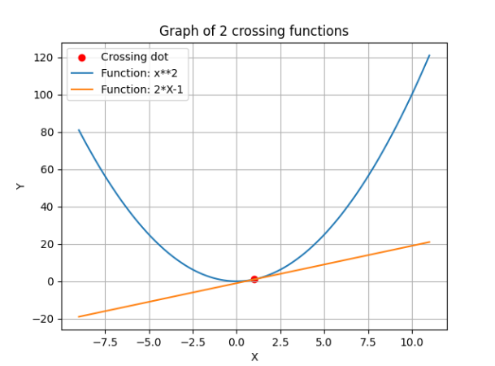

# Graph.py

    

    Program that finds a common point between two functions that are given by the user.

    • After starting, the user is asked to specify two functions whose common point must be found. 
      The user also provides a starting point for the search. 
      The functions will be given in turn, an example form of the function to be entered that's 2*x - 1.
    • Information about the found common point (or lack of such a point) displayed on the console.
    • If a common point has been found, display a graph showing the progress of the functions and mark
      the intersection of these functions separately. The chart have a legend, a grid, and signed axes.
## Screenshot

 

